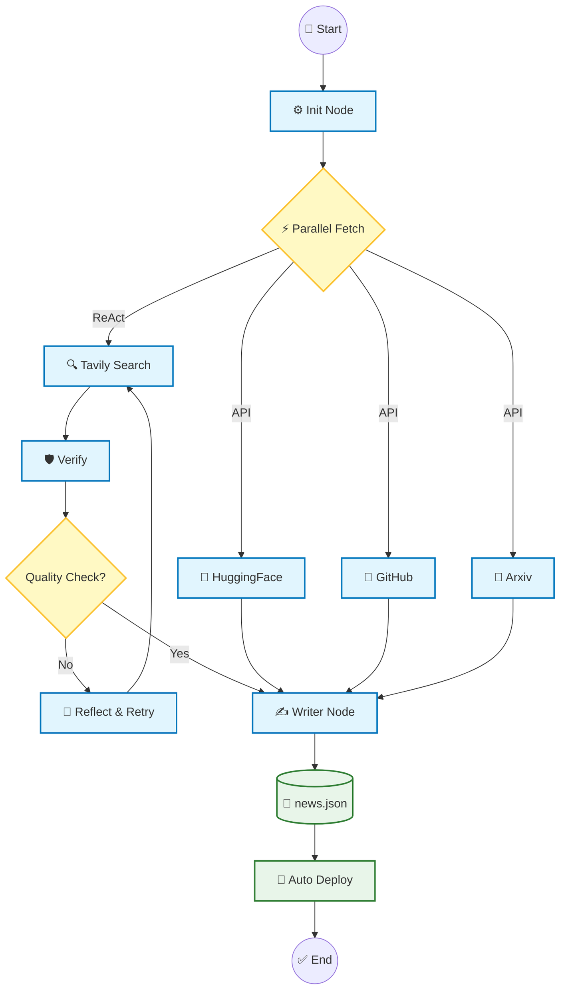

# 🤖 AI Daily Insight (Project Panorama)

> **全自动化的 AI 趋势聚合平台。**
> **Python Agent** 负责抓取清洗，**Next.js** 负责高颜值呈现。
> **自动部署**在 Vercel，**定时更新**通过 GitHub Actions。


## 📖 简介 (Introduction)

**AI Daily Insight** 是一个自动化的 AI 趋势聚合工具。它利用 **LLM Agent** 每天并行抓取各大科技源（Product Hunt, Hugging Face, GitHub, Arxiv），经由 ReAct 认知架构清洗、去重、翻译，最终生成结构化的中文简报。

**🌐 在线访问**: https://ai-daily-web-r.vercel.app/

---

## 🏗️ 架构设计 (Architecture)

本项目基于 **LangGraph** 构建了一个**循环状态图 (Cyclic Graph)**，实现了具有自我纠错能力的 Agent 工作流。



### 核心设计 (Core Philosophy)

* **Cyclic State Graph**: 采用有环图结构，赋予 Agent **自我修正 (Self-Correction)** 能力。当检索信息量不足时，自动触发反思并扩展查询词。
* **Parallel Execution**: 针对 API 数据源（GitHub/HF/Arxiv）采用异步并行调度，显著降低聚合延迟。
* **Decoupled Architecture**: Python 后端与 Next.js 前端通过 JSON 协议完全解耦，支持边缘网络部署。

---

## 🚀 快速开始 (Quick Start)

本项目内置 **Makefile**，支持一键部署。

### 1. 安装与配置
下载代码并安装依赖：

```bash
git clone https://github.com/wuhao980527-gif/ai-daily-web.git
cd ai-daily-web && make install
```

### 2. 配置密钥
在 `python_backend` 目录下新建 `.env` 文件，填入 API Key：

```ini
# LLM Provider
MY_API_KEY=sk-xxxxxx
MY_BASE_URL=https://api.openai.com/v1
MY_MODEL_NAME=gpt-4o

# Search Tools
TAVILY_API_KEY=tvly-xxxxxx
```

**注意**: GitHub Actions 自动运行需要使用 **公网可访问** 的 API（如 OpenAI、Groq 等），不能使用内网网关。

### 3. 一键运行
执行全流程（抓取 -> 清洗 -> 生成 -> 预览）：

```bash
make run
```
*访问 http://localhost:3000 查看最新日报。*

---

## 🔄 自动更新机制 (Auto Update)

本项目已实现 **全自动定时更新**：

### GitHub Actions 定时任务
- **触发时间**: 每天 UTC 01:00 (北京时间 09:00)
- **执行内容**: 自动运行 Python Agent 抓取最新 AI 资讯
- **数据更新**: 将结果保存到 `data/news.json` 并自动提交到仓库
- **自动部署**: Vercel 监听到 `data/news.json` 变化后自动重新部署网站

### 手动触发更新
在 GitHub 仓库页面的 **Actions** 标签页，可以手动点击 "Run workflow" 立即执行更新。

### 配置要求
在 GitHub 仓库的 **Settings → Secrets and variables → Actions** 中配置以下 Secrets：

| Secret | 说明 |
|--------|------|
| `MY_API_KEY` | LLM API 密钥 (支持 OpenAI, Groq, Together.ai 等) |
| `MY_BASE_URL` | API 地址 (如 `https://api.openai.com/v1`) |
| `MY_MODEL_NAME` | 模型名称 (如 `gpt-4o-mini`) |
| `TAVILY_API_KEY` | Tavily 搜索 API 密钥 |

---

## 🛠 技术栈 (Tech Stack)

* **Backend**: LangGraph, LangChain, LLM (GPT-4o, Claude, etc.), Tavily API
* **Frontend**: Next.js 14 (App Router), Tailwind CSS
* **DevOps**: GitHub Actions, Vercel
* **数据存储**: JSON 文件 (data/news.json)

---

---

## 📂 目录结构 (Structure)

```text
.
├── app/                  # Next.js 前端逻辑
├── python_backend/       # LangGraph Agent 核心代码
│   ├── agent_graph.py    # 工作流定义
│   ├── agent_tools.py    # 搜索与验证工具
├── data/
│   └── news.json         # 数据交换协议
├── Makefile              # 自动化指令
└── README.md             # 说明文档
```

---

## 📝 License

[MIT License](LICENSE) © 2026 AI Daily Insight