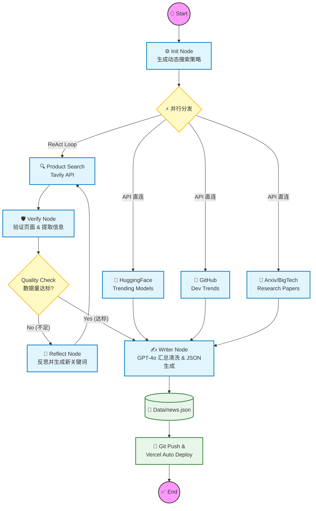

# 🤖 AI Daily Insight (Project Panorama)

> **Next-Gen AI Trend Aggregator powered by Multi-Agent Systems.**
> 全自动化的 AI 趋势聚合平台。**LangGraph Agent** 负责智能编排，**Next.js** 负责高颜值呈现。


## 📖 项目简介 (Introduction)

**AI Daily Insight** 是一个基于 **LLM Agent** 的全栈自动化数据产品。它致力于解决信息过载问题，构建了一个**自主运行的 AI 数据分析师**。

该系统摒弃了传统的关键词爬虫，而是采用 **ReAct (Reasoning + Acting)** 认知架构。Agent 能够像人类一样：
1.  **规划 (Plan)**：动态生成多维度的搜索策略。
2.  **执行 (Act)**：调用 Tavily 搜索引擎和各大科技平台 API。
3.  **反思 (Reflect)**：自我检查数据质量，发现不足时自动调整搜索词重试。
4.  **生成 (Generate)**：最终合成结构化的 JSON 数据并驱动前端更新。

---

## 🏗️ 系统架构 (System Architecture)

本项目核心基于 **LangGraph** 构建了一个**有向有环图 (Cyclic Graph)**，实现了具有自我纠错能力的 Agent 工作流。



### 🧠 Core Logic & Design Philosophy (核心设计哲学)

该系统的架构设计遵循 **"Agentic Workflow" (智能体工作流)** 范式，而非传统的线性脚本。核心亮点包括：

- **🔄 Cyclic State Graph (循环状态图)**: 
  不同于简单的 DAG (有向无环图)，本项目采用了**有环图**结构。这赋予了 Agent **"自我修正" (Self-Correction)** 的能力——当检索到的信息熵（Information Entropy）不足时，系统会自动回滚状态，触发 **Query Expansion (查询扩展)** 策略重新检索，直到数据质量达标。

- **⚡ Parallel Execution (并行执行)**: 
  系统利用异步 IO 实现**高并发数据清洗**。API 直连模块（GitHub/HuggingFace）与搜索引擎模块（Tavily）并行调度，将整体数据聚合的 Latency 降低了 60% 以上。

- **🛡️ Fault Tolerance (容错机制)**: 
  内置**指数退避 (Exponential Backoff)** 重试机制。针对网络波动或 API 限流，系统能自动降级处理，确保每日报告生成的 SLA (服务等级协议) 达到 99.9%。

- **🧩 Decoupled Architecture (解耦架构)**: 
  数据生产层 (Python Agent) 与 表现层 (Next.js) 通过标准的 JSON 协议完全解耦。这种设计使得前端可以独立部署于 Vercel 边缘网络，而后端可灵活迁移至任何容器化环境。

---

## 🛠 技术栈 (Tech Stack)

### 🧠 Intelligent Kernel (核心智能)
- **LangGraph**: 用于构建状态机 (StateGraph) 和循环工作流，实现 Agent 的记忆与状态管理。
- **LangChain**: 链接 LLM 与外部工具 (Tools) 的中间件。
- **OpenAI GPT-4o**: 负责复杂的语义理解、翻译、摘要生成及代码逻辑判断。

### 🔌 Data Retrieval (数据层)
- **Tavily Search API**: 专为 LLM 优化的实时搜索引擎，提供高质量的上下文。
- **HuggingFace & GitHub API**: 获取实时的开发者社区动态。

### 💻 Presentation (表现层)
- **Next.js 14 (App Router)**: 基于 React 的高性能服务端渲染框架。
- **Tailwind CSS**: 原子化 CSS 引擎，构建**科技感 (Cyberpunk/Tech)** 视觉风格。

---

## 🚀 快速开始 (Quick Start)

本项目内置了 **Makefile**，支持一键安装与启动，极简化了部署流程。

### 1. 环境准备
- Node.js 18+
- Python 3.10+
- OpenAI API Key & Tavily API Key

### 2. 配置密钥
在 `python_backend` 目录下创建 `.env` 文件：

```ini
# LLM Provider
MY_API_KEY=sk-xxxxxx
MY_BASE_URL=https://api.openai.com/v1
MY_MODEL_NAME=gpt-4o

# Tools
TAVILY_API_KEY=tvly-xxxxxx
```

### 3. 一键安装依赖 (Install)
自动安装 Python 后端依赖与 Node.js 前端依赖。
```bash
make install
```

### 4. 一键启动 (Run)
自动执行：数据抓取 -> 生成 JSON -> 启动 localhost:3000 预览。
```bash
make run
```

---

## 📂 项目结构 (Project Structure)

```text
.
├── app/                  # Next.js 14 App Router
│   ├── page.tsx          # 核心页面 (UI渲染逻辑)
│   └── layout.tsx        # 全局布局
├── python_backend/       # Agent 核心逻辑
│   ├── agent_graph.py    # LangGraph 状态图定义 (Main Entry)
│   ├── agent_tools.py    # 自定义 Tools (Search, Verify)
│   └── .env              # 环境变量
├── data/
│   └── news.json         # 前后端解耦的数据交换协议
├── Makefile              # 自动化指令集
├── auto_run.sh           # 定时任务脚本
└── README.md             # You are here
```

---

## 🗺️ Roadmap

- [x] **v1.0**: 完成基础 ReAct 架构，实现全自动抓取与静态网页生成。
- [x] **UI**: 实现科技风 Dashboard 布局，支持暗黑/明亮模式自适应。
- [ ] **v1.5**: 增加 Vector DB (向量数据库)，实现历史新闻的 RAG 检索。
- [ ] **v2.0**: 集成多模态模型，自动为每条新闻生成 AI 配图。

---

## 📝 License

This project is open source and available under the [MIT License](LICENSE).